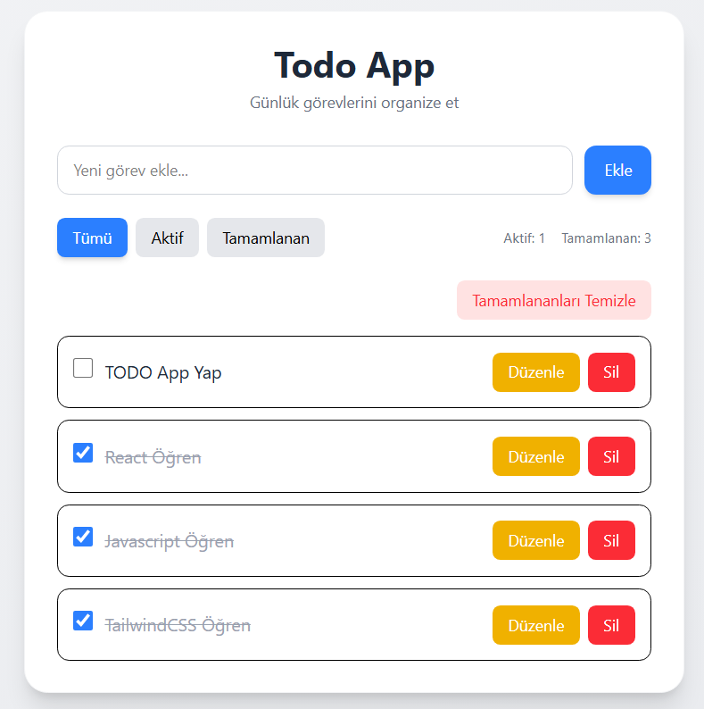
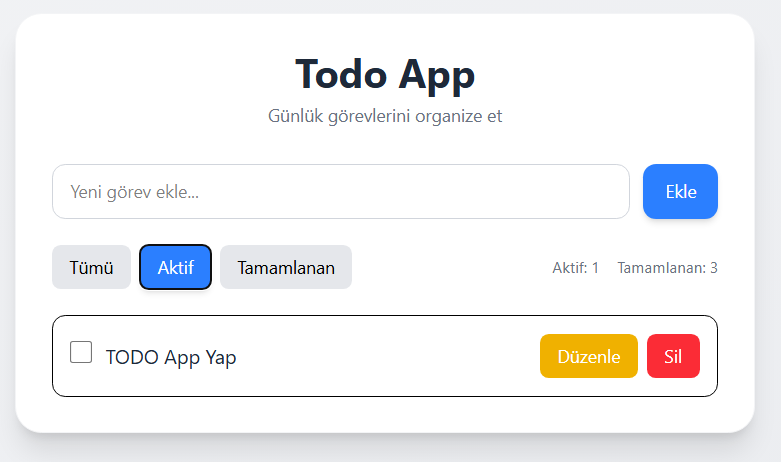
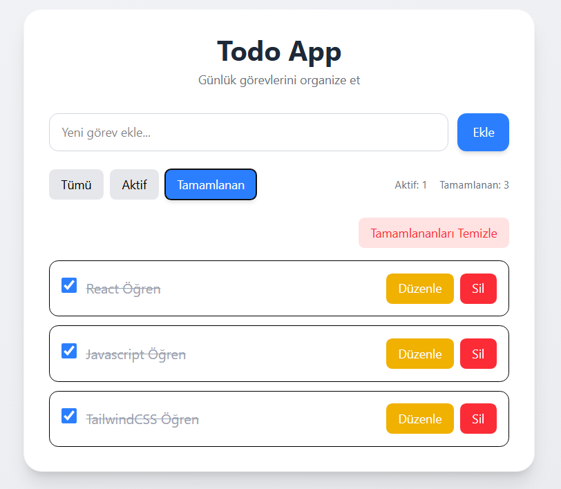
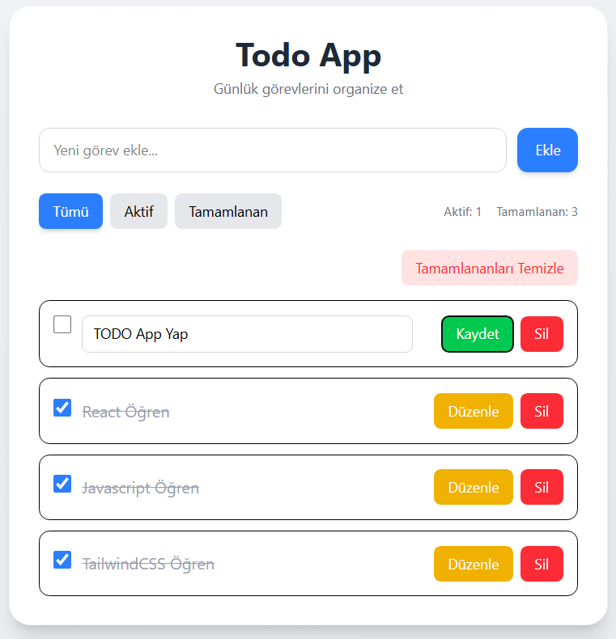
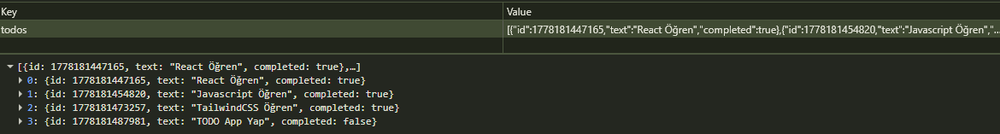

# React Todo App

Modern ve responsive bir Todo uygulaması.  
Bu proje, ReactJS ve Tailwind CSS kullanılarak geliştirilmiştir.

## 🌍 Canlı Proje

🔗 Live Demo:

https://todo-app-organizer.netlify.app/

## 🔩 Özellikler

- Todo ekleme
- Todo listeleme
- Todo güncelleme
- Todo silme
- Tamamlandı işaretleme
- Filter sistemi
  - Tümü
  - Aktif
  - Tamamlanan
- LocalStorage desteği
- Responsive tasarım
- Modern kullanıcı arayüzü

---

## 🛠️ Kullanılan Teknolojiler

- ReactJS
- Vite
- Tailwind CSS
- JavaScript
- LocalStorage API

---

## 📸 Uygulama Görselleri

### 📝 Tümü (All)



---

### ⚡ Aktif Görevler



---

### ✅ Tamamlanan Görevler



---

### 🖊️ Düzenleme Alanı



---

### 💾 LocalStorage Verileri



---

## 📂 Proje Kurulumu

Projeyi çalıştırmak için:

```bash
npm install
npm run dev
